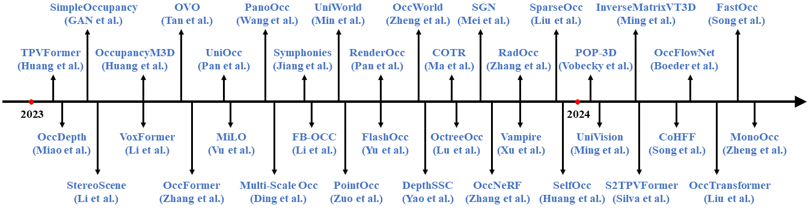

# Awesome-Multi-Camera-3D-Occupancy-Prediction

### CVPR
#### 2024
+ [2024.04] SparseOcc: Rethinking Sparse Latent Representation for Vision-Based Semantic Occupancy Prediction [[paper](https://arxiv.org/abs/2404.09502)] [[github](https://github.com/VISION-SJTU/SparseOcc)]
+ [2024.04] StreamingFlow: Streaming Occupancy Forecasting with Asynchronous Multi-modal Data Streams via Neural Ordinary Differential Equation [[github](https://github.com/synsin0/StreamingFlow)]
+ [2024.04] Unsupervised Occupancy Learning from Sparse Point Cloud [[paper](https://arxiv.org/abs/2404.02759)]
+ [2024.02] Collaborative Semantic Occupancy Prediction with Hybrid Feature Fusion in Connected Automated Vehicles [[paper](https://arxiv.org/abs/2402.07635)] [[github](https://rruisong.github.io/publications/CoHFF/)]
+ [2023.12] Cam4DOcc: Benchmark for Camera-Only 4D Occupancy Forecasting in Autonomous Driving Applications [[paper](https://arxiv.org/pdf/2311.17663.pdf)] [[github](https://github.com/haomo-ai/Cam4DOcc)]
+ [2023.12] COTR: Compact Occupancy TRansformer for Vision-based 3D Occupancy Prediction [[paper](https://arxiv.org/pdf/2312.01919v1.pdf)]
+ [2023.11] SelfOcc: Self-Supervised Vision-Based 3D Occupancy Prediction [[paper](https://arxiv.org/pdf/2311.12754.pdf)] [[github](https://github.com/huang-yh/SelfOcc)]
+ [2023.06] PanoOcc: Unified Occupancy Representation for Camera-based 3D Panoptic Segmentation [[paper](https://arxiv.org/pdf/2306.10013.pdf)] [[github](https://github.com/Robertwyq/PanoOcc)]
+ [2023.05] OccupancyM3D: Learning Occupancy for Monocular 3D Object Detection [[paper](https://arxiv.org/pdf/2305.15694.pdf)] [[github](https://github.com/SPengLiang/OccupancyM3D)]
+ [2024] Accurate Training Data for Occupancy Map Prediction in Automated Driving using Evidence Theory
+ [2024] LowRankOcc: Tensor Decomposition and Low-Rank Recovery for Vision-based 3D Semantic Occupancy Prediction
+ [2024] SGC-Occ: Semantic-Geometry Consistent 3D Occupancy Prediction for Autonomous Driving
+ [2024] UnO: Unsupervised Occupancy Fields for Perception and Forecasting
+ [2024] Diffusion-FOF: Single-view Clothed Human Reconstruction via Diffusion-based Fourier Occupancy Field
#### 2023
+ [2023.02] TPVFormer: Tri-Perspective View for Vision-Based 3D Semantic Occupancy Prediction [[paper](https://arxiv.org/abs/2302.07817)] [[github](https://github.com/wzzheng/TPVFormer)] [[zhihu](https://zhuanlan.zhihu.com/p/618500881)] [[bilibili](https://www.bilibili.com/video/BV1P54y1T7vS/?share_source=copy_web&vd_source=7dba3db6bbc0b271c793335ecf5f2c31)]
+ [2023.02] VoxFormer: a Cutting-edge Baseline for 3D Semantic Occupancy Prediction [[paper](https://arxiv.org/abs/2302.12251)] [[github](https://github.com/NVlabs/VoxFormer)] [[zhihu](https://zhuanlan.zhihu.com/p/619156102)]
+ [2023.01] Behind the Scenes: Density Fields for Single View Reconstruction[[paper](https://arxiv.org/abs/2301.07668)] [[github](https://github.com/Brummi/BehindTheScenes)] [[zhihu](https://zhuanlan.zhihu.com/p/637063945)]
+ [2022.12] UniAD: Planning-oriented Autonomous Driving [[paper](https://arxiv.org/abs/2212.10156)] [[code](https://github.com/OpenDriveLab/UniAD)]
#### 2022
+ [2021.12] MonoScene: Monocular 3D Semantic Scene Completion [[paper](https://arxiv.org/abs/2112.00726)] [[github](https://github.com/astra-vision/MonoScene)] [[zhihu](https://zhuanlan.zhihu.com/p/495846985)]

### ICCV
#### 2023
+ [2023.04] OccFormer: Dual-path Transformer for Vision-based 3D Semantic Occupancy Prediction [[paper](https://arxiv.org/abs/2304.05316)] [[github](https://github.com/zhangyp15/OccFormer)]
+ [2023.03] SurroundOcc [[paper](https://arxiv.org/abs/2303.09551)] [[github](https://github.com/weiyithu/SurroundOcc)] [[zhihu](https://zhuanlan.zhihu.com/p/618202310)]

### AAAI
#### 2024
+ [2023.12] RadOcc: Learning Cross-Modality Occupancy Knowledge through Rendering Assisted Distillation [[paper](https://arxiv.org/abs/2312.11829)]
+ [2023.08] SOGDet: Semantic-Occupancy Guided Multi-view 3D Object Detection [[paper](https://arxiv.org/abs/2308.13794)] [[code](https://github.com/zhouqiu/SOGDet)]

### Journal
+ [2023.12] ML3DOP: A Multi-Camera and LiDAR Dataset for 3D Occupancy Perception[[paper](https://ieeexplore.ieee.org/abstract/document/10363646)] [[github](https://github.com/lvchuandong/ML3DOP)] [IEEE Transactions on Intelligent Vehicles]

### ICRA
#### 2024
+ [2024.03] FastOcc: Accelerating 3D Occupancy Prediction by Fusing the 2D Bird’s-Eye View and Perspective View [[paper](https://arxiv.org/pdf/2403.02710v1.pdf)]

### NeurIPS
#### 2023
+ [2024.01] POP-3D: Open-Vocabulary 3D Occupancy Prediction from Images [[paper](https://proceedings.neurips.cc/paper_files/paper/2023/file/9e30acdeff572463c1db9b7de59de64c-Paper-Conference.pdf)] [[code](https://github.com/vobecant/POP3D)] [[website](https://vobecant.github.io/POP3D/)]
+ [2023.12] Occ3D: A Large-Scale 3D Occupancy Prediction Benchmark for Autonomous Driving [[paper](https://proceedings.neurips.cc/paper_files/paper/2023/file/cabfaeecaae7d6540ee797a66f0130b0-Paper-Datasets_and_Benchmarks.pdf)] [[code](https://github.com/Tsinghua-MARS-Lab/Occ3D)] [[website](https://tsinghua-mars-lab.github.io/Occ3D/)]

### Arxiv
+ [2024.04] SparseOcc: Rethinking Sparse Latent Representation for Vision-Based Semantic Occupancy Prediction [[paper](https://arxiv.org/abs/2404.09502)] [[github](https://github.com/VISION-SJTU/SparseOcc)]
+ [2024.04] Co-Occ: Coupling Explicit Feature Fusion with Volume Rendering Regularization for Multi-Modal 3D Semantic Occupancy Prediction [[paper](https://arxiv.org/abs/2404.04561)] [[code](https://github.com/Rorisis/Co-Occ)] [[website](https://rorisis.github.io/Co-Occ_project-page/)]
+ [2024.04] Unsupervised Occupancy Learning from Sparse Point Cloud [[paper](https://arxiv.org/abs/2404.02759)]
+ [2024.03] Urban Scene Diffusion through Semantic Occupancy Map [[paper](https://arxiv.org/pdf/2403.11697.pdf)] [[website](https://metadriverse.github.io/urbandiff/)]
+ [2024.03] MonoOcc: Digging into Monocular Semantic Occupancy Prediction [[paper](https://arxiv.org/pdf/2403.08766v1.pdf)] [[code](https://github.com/ucaszyp/MonoOcc)]
+ [2024.03] Real-time 3D semantic occupancy prediction for autonomous vehicles using memory-efficient sparse convolution [[paper](https://arxiv.org/abs/2403.08748)]
+ [2024.03] UniLiDAR: Bridge the domain gap among different LiDARs for continual learning [[paper](https://arxiv.org/pdf/2403.08512.pdf)]
+ [2024.03] OccFiner: Offboard Occupancy Refinement with Hybrid Propagation [[paper](https://arxiv.org/pdf/2403.08504.pdf)]
+ [2024.03] Unleashing HyDRa: Hybrid Fusion, Depth Consistency and Radar for Unified 3D Perception [[paper](https://arxiv.org/pdf/2403.07746.pdf)] [[code](https://github.com/phi-wol/hydra)]
+ [2024.03] OccFusion: Depth Estimation Free Multi-sensor Fusion for 3D Occupancy Prediction [[paper](https://arxiv.org/pdf/2403.05329.pdf)]
+ [2024.03] FastOcc: Accelerating 3D Occupancy Prediction by Fusing the 2D Bird’s-Eye View and Perspective View [[paper](https://arxiv.org/pdf/2403.02710v1.pdf)]
+ [2024.03] OccFusion: A Straightforward and Effective Multi-Sensor Fusion Framework for 3D Occupancy Prediction [[paper](https://arxiv.org/html/2403.01644v1)] [[~~code~~](https://github.com/DanielMing123/OCCFusion)]
+ [2024.02] OccTransformer: Improving BEVFormer for 3D camera-only occupancy prediction [[paper](https://arxiv.org/pdf/2402.18140.pdf)]
+ [2024.02] OccFlowNet: Towards Self-supervised Occupancy Estimation via Differentiable Rendering and Occupancy Flow [[paper](https://arxiv.org/pdf/2402.12792v1.pdf)]
+ [2024.02] SDGE: Stereo Guided Depth Estimation for 360∘ Camera Sets [[paper](https://arxiv.org/pdf/2402.11791.pdf)]
+ [2024.01] S2TPVFormer: Spatio-Temporal Tri-Perspective View for temporally coherent 3D Semantic Occupancy Prediction [[paper](https://arxiv.org/pdf/2401.13785.pdf)]
+ [2024.01] InverseMatrixVT3D: An Efficient Projection Matrix-Based Approach for 3D Occupancy Prediction [[paper](https://arxiv.org/pdf/2401.12422.pdf)] [[code](https://github.com/DanielMing123/InverseMatrixVT3D)]
+ [2024.01] UniVision: A Unified Framework for Vision-Centric 3D Perception [[paper](https://arxiv.org/pdf/2401.06994.pdf)] [[code](https://github.com/Cc-Hy/UniVision)]
+ [2023.12] Fully Sparse 3D Panoptic Occupancy Prediction [[paper](https://arxiv.org/abs/2312.17118)] [[code](https://github.com/MCG-NJU/SparseOcc)]
+ [2023.12] Regulating Intermediate 3D Features for Vision-Centric Autonomous Driving [[paper](https://arxiv.org/pdf/2312.11837v1.pdf)] [[code](https://github.com/cskkxjk/Vampire)]
+ [2023.12] RadOcc: Learning Cross-Modality Occupancy Knowledge through Rendering Assisted Distillation [[paper](https://arxiv.org/abs/2312.11829)]
+ [2023.12] OccNeRF: Self-Supervised Multi-Camera Occupancy Prediction with Neural Radiance Fields [[paper](https://arxiv.org/abs/2312.09243)] [[code](https://github.com/LinShan-Bin/OccNeRF)]
+ [2023.12] Camera-based 3D Semantic Scene Completion with Sparse Guidance Network [[paper](https://arxiv.org/pdf/2312.05752v1.pdf)] [[code](https://github.com/Jieqianyu/SGN)]
+ [2023.12] OctreeOcc: Efficient and Multi-Granularity Occupancy Prediction Using Octree Queries [[paper](https://arxiv.org/abs/2312.03774)] [[code](https://github.com/4DVLab/OctreeOcc)]
+ [2023.11] DepthSSC: Depth-Spatial Alignment and Dynamic Voxel Resolution for Monocular 3D Semantic Scene Completion [[paper](https://arxiv.org/pdf/2311.17084.pdf)]
+ [2023.11] OccWorld: Learning a 3D Occupancy World Model for Autonomous Driving [[paper](https://arxiv.org/pdf/2311.16038.pdf)] [[code](https://github.com/wzzheng/OccWorld)]
+ [2023.11] Technical Report for Argoverse Challenges on 4D Occupancy Forecasting [[paper](https://arxiv.org/pdf/2311.15660.pdf)]
+ [2023.10] LiDAR-based 4D Occupancy Completion and Forecasting [[paper](https://arxiv.org/abs/2310.11239)] [[code](https://github.com/ai4ce/Occ4cast)]
+ [2023.11] SelfOcc: Self-Supervised Vision-Based 3D Occupancy Prediction [[paper](https://arxiv.org/abs/2311.12754)] [[github](https://github.com/huang-yh/SelfOcc)]
+ [2023.11] SOccDPT: Semi-Supervised 3D Semantic Occupancy from Dense Prediction Transformers trained under memory constraints [[paper](https://arxiv.org/abs/2311.11371)]
+ [2023.11] FlashOcc: Fast and Memory-Efficient Occupancy Prediction via Channel-to-Height Plugin [[paper](https://arxiv.org/abs/2311.12058)] [[code](https://github.com/Yzichen/FlashOCC)]
+ [2023.10] Predicting Future Spatiotemporal Occupancy Grids with Semantics for Autonomous Driving [[paper](https://arxiv.org/pdf/2310.01723.pdf)]
+ [2023.09] OccupancyDETR: Making Semantic Scene Completion as Straightforward as Object Detection[[paper](https://arxiv.org/abs/2309.08504)]
+ [2023.09] OCC-VO: Dense Mapping via 3D Occupancy-Based Visual Odometry for Autonomous Driving [[paper](https://arxiv.org/abs/2309.11011)]
+ [2023.09] SPOT: Scalable 3D Pre-training via Occupancy Prediction for Autonomous Driving[[paper](https://arxiv.org/abs/2309.10527)]
+ [2023.09] RenderOcc: Vision-Centric 3D Occupancy Prediction with 2D Rendering Supervision [[paper](https://arxiv.org/abs/2309.09502)] [[github](https://github.com/pmj110119/RenderOcc)]
+ [2023.08] PointOcc: Cylindrical Tri-Perspective View for Point-based 3D Semantic Occupancy Prediction [[paper](https://arxiv.org/abs/2308.16896)] [[github](https://github.com/wzzheng/PointOcc)]
+ [2023.07] OCTraN: 3D Occupancy Convolutional Transformer Network in Unstructured Traffic Scenarios [[paper](https://arxiv.org/abs/2307.10934)]
+ [2023.07] FB-OCC: 3D Occupancy Prediction based on Forward-Backward View Transformation [[paper](https://arxiv.org/abs/2307.01492)] [[github](https://github.com/NVlabs/FB-BEV)]
+ [2023.06] PanoOcc: Unified Occupancy Representation for Camera-based 3D Panoptic Segmentation [[paper](https://arxiv.org/abs/2306.10013)] [[github](https://github.com/Robertwyq/PanoOcc)]
+ [2023.06] UniOcc: Unifying Vision-Centric 3D Occupancy Prediction with Geometric and Semantic Rendering [[paper](https://arxiv.org/abs/2306.09117)] 
+ [2023.05] OVO: Open-Vocabulary Occupancy [[paper](https://arxiv.org/abs/2305.16133)] [[github](https://github.com/dzcgaara/OVO-Open-Vocabulary-Occupancy)]
+ [2023.05] Learning Occupancy for Monocular 3D Object Detection [[paper](https://arxiv.org/abs/2305.15694)] [[github](https://github.com/spengliang/occupancym3d)]
+ [2023.05] UniScene: Multi-Camera Unified Pre-training via 3D Scene Reconstruction [[paper](https://arxiv.org/abs/2305.18829)] [[github](https://github.com/chaytonmin/UniScene)]
+ [2023.04] OccFormer: Dual-path Transformer for Vision-based 3D Semantic Occupancy Prediction [[paper](https://arxiv.org/abs/2304.05316)] [[github](https://github.com/zhangyp15/OccFormer)]
+ [2023.03] SurroundOcc: Multi-Camera 3D Occupancy Prediction for Autonomous Driving [[paper](https://arxiv.org/abs/2303.09551)] [[github](https://github.com/weiyithu/SurroundOcc)]
+ [2023.03] OpenOccupancy: A Large Scale Benchmark for Surrounding Semantic Occupancy Perception [[paper](https://arxiv.org/abs/2303.03991)] [[github](https://github.com/JeffWang987/OpenOccupancy)]
+ [2023.03] BEVDet for occupancy: [[github](https://github.com/HuangJunJie2017/BEVDet/tree/dev2.1/configs/bevdet_occ)]
+ [2023.03] SimpleOccupancy: A Simple Attempt for 3D Occupancy Estimation in Autonomous Driving [[paper](https://arxiv.org/abs/2303.10076)] [[github](https://github.com/GANWANSHUI/SimpleOccupancy)]
+ [2023.02] OccDepth: A Depth-aware Method for 3D Semantic Occupancy Network [[paper](https://arxiv.org/abs/2302.13540)] [[github](https://github.com/megvii-research/OccDepth)]  
+ [2023.02] TPVFormer: Tri-Perspective View for Vision-Based 3D Semantic Occupancy Prediction [[paper](https://arxiv.org/abs/2302.07817)] [[github](https://github.com/wzzheng/TPVFormer)] [[zhihu](https://zhuanlan.zhihu.com/p/618500881)] [[bilibili](https://www.bilibili.com/video/BV1P54y1T7vS/?share_source=copy_web&vd_source=7dba3db6bbc0b271c793335ecf5f2c31)]

### Occupancy Datasets
+ [2023.06] SSCBench: A Large-Scale 3D Semantic Scene Completion Benchmark for Autonomous Driving [[paper](https://arxiv.org/abs/2306.09001)] [[github](https://github.com/ai4ce/SSCBench)]
+ [2023.06] Scene as Occupancy [[paper](https://arxiv.org/abs/2306.02851)] [[github](https://github.com/OpenDriveLab/OccNet)]
+ [2023.04] Occ3D: A Large-Scale 3D Occupancy Prediction Benchmark for Autonomous Driving [[paper](https://arxiv.org/abs/2304.14365)] [[github](https://github.com/Tsinghua-MARS-Lab/Occ3D)]
+ [2023.03] OpenOccupancy: A Large Scale Benchmark for Surrounding Semantic Occupancy Perception [[paper](https://arxiv.org/abs/2303.03991)] [[github](https://github.com/JeffWang987/OpenOccupancy)]
+ [2023.03] SurroundOcc [[paper](https://arxiv.org/abs/2303.09551)] [[github](https://github.com/weiyithu/SurroundOcc)]
+ Occupancy Dataset for nuScenes [[github](https://github.com/FANG-MING/occupancy-for-nuscenes)]
+ [2023.12] ML3DOP: A Multi-Camera and LiDAR Dataset for 3D Occupancy Perception[[paper](https://ieeexplore.ieee.org/abstract/document/10363646)] [[github](https://github.com/lvchuandong/ML3DOP)]

### Survey
+ [2024.05] Vision-based 3D occupancy prediction in autonomous driving: a review and outlook [[paper](https://arxiv.org/abs/2405.02595)]
+ [2023.03] Grid-Centric Traffic Scenario Perception for Autonomous Driving: A Comprehensive Review [[paper](https://arxiv.org/abs/2303.01212)]

### Pre-training
+ [2023.05] Occ-BEV: Multi-Camera Unified Pre-training via 3D Scene Reconstruction [[paper](https://arxiv.org/abs/2305.18829)] [[github](https://github.com/chaytonmin/Occ-BEV)]
+ [2022.06] Occupancy-MAE: Self-supervised Pre-training Large-scale LiDAR Point Clouds with Masked Occupancy Autoencoders [[paper](https://arxiv.org/abs/2206.09900)] [[github](https://github.com/chaytonmin/Occupancy-MAE)]

### 3D Occupancy Prediction Challenge
+ CVPR 2023 3D Occupancy Prediction Challenge: The world's First 3D Occupancy Benchmark for Scene Perception in Autonomous Driving [[github](https://github.com/CVPR2023-3D-Occupancy-Prediction/CVPR2023-3D-Occupancy-Prediction)] [[website](https://opendrivelab.com/challenge2023/#3d_occupancy_prediction)]
+ CVPR 2024 Autonomous Grand Challenge Occupancy and Flow [[github](https://github.com/OpenDriveLab/OccNet)] [[website](https://opendrivelab.com/challenge2024/#occupancy_and_flow)]

### Tesla's Occupancy Networks
+  A Look at Tesla's Occupancy Networks [[CVPR2022 workshop](https://www.youtube.com/watch?v=KC8e0oTFUcw)] [[Tesla AI Day 2022](https://www.youtube.com/watch?v=ODSJsviD_SU&t=4403s)] [[Video](https://youtu.be/Nu3LUB8wolc?si=FARyGHEqbY94yKuN)]

### Blog
+ [Occupancy Network 系列论文汇总](https://zhuanlan.zhihu.com/p/620907153)
+ [近两年occupancy文章整理](https://zhuanlan.zhihu.com/p/676112208)
+ [Awesome-Multi-Camera-3D-Occupancy-Prediction](https://zhuanlan.zhihu.com/p/669395841)

### Code for Occupancy Generation 
+ multi-frame fusion [[github](https://github.com/FANG-MING/occupancy-for-nuscenes/blob/main/data_converter.py)]
+ Poisson reconstruction [[github](https://github.com/weiyithu/SurroundOcc/blob/main/tools/generate_occupancy_with_own_data/process_your_own_data.py)]

## Related Projects
+ [Awesome-Occupancy-Prediction-Multi-Cameras](https://github.com/chaytonmin/Awesome-Surrounding-Semantic-Occupancy-Prediction/tree/main)
+ [Awesome-3D-Occupancy-Prediction](https://github.com/zya3d/Awesome-3D-Occupancy-Prediction)
+ [Awesome-occupancy-perception](https://github.com/autodriving-heart/Awesome-occupancy-perception)
+ [awesome-Occupancy-research](https://github.com/keithAND2020/awesome-Occupancy-research)