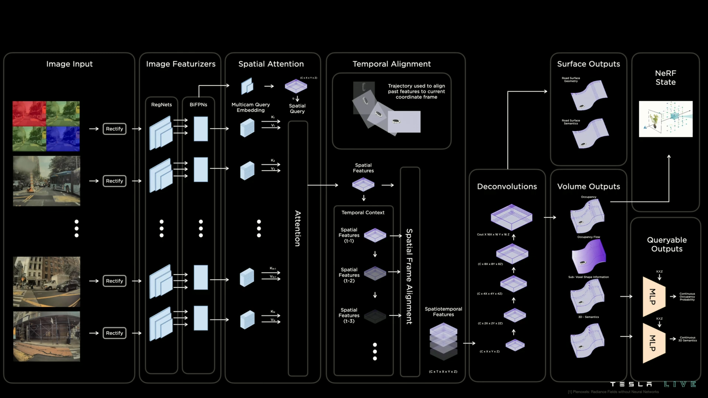

# Awesome-Multi-Camera-3D-Occupancy-Prediction

### CVPR
#### 2023
+ TPVFormer: Tri-Perspective View for Vision-Based 3D Semantic Occupancy Prediction [[paper](https://arxiv.org/abs/2302.07817)] [[Github](https://github.com/wzzheng/TPVFormer)] [[Zhihu](https://zhuanlan.zhihu.com/p/618500881)] [[bilibili](https://www.bilibili.com/video/BV1P54y1T7vS/?share_source=copy_web&vd_source=7dba3db6bbc0b271c793335ecf5f2c31)]
+ VoxFormer: a Cutting-edge Baseline for 3D Semantic Occupancy Prediction [[paper](https://arxiv.org/abs/2302.12251)] [[Github](https://github.com/NVlabs/VoxFormer)] [[Zhihu](https://zhuanlan.zhihu.com/p/619156102)]
+ Behind the Scenes: Density Fields for Single View Reconstruction[[paper](https://arxiv.org/abs/2301.07668)] [[Github](https://github.com/Brummi/BehindTheScenes)] [[Zhihu](https://zhuanlan.zhihu.com/p/637063945)]
#### 2022
+ MonoScene: Monocular 3D Semantic Scene Completion [[paper](https://arxiv.org/abs/2112.00726)] [[Github](https://github.com/astra-vision/MonoScene)] [[Zhihu](https://zhuanlan.zhihu.com/p/495846985)]

### ICCV
#### 2023
+ SurroundOcc [[paper](https://arxiv.org/abs/2303.09551)] [[Github](https://github.com/weiyithu/SurroundOcc)][[Zhihu](https://zhuanlan.zhihu.com/p/618202310)]

### Arxiv
+ SelfOcc: Self-Supervised Vision-Based 3D Occupancy Prediction[[paper](https://arxiv.org/abs/2311.12754)][[Github](https://github.com/huang-yh/SelfOcc)]
+ SOccDPT: Semi-Supervised 3D Semantic Occupancy from Dense Prediction Transformers trained under memory constraints[[paper](https://arxiv.org/abs/2311.11371)]
+ FlashOcc: Fast and Memory-Efficient Occupancy Prediction via Channel-to-Height Plugin[[paper](https://arxiv.org/abs/2311.12058)]
+ OccupancyDETR: Making Semantic Scene Completion as Straightforward as Object Detection[[paper](https://arxiv.org/abs/2309.08504)]
+ OCC-VO: Dense Mapping via 3D Occupancy-Based Visual Odometry for Autonomous Driving[[paper](https://arxiv.org/abs/2309.11011)]
+ SPOT: Scalable 3D Pre-training via Occupancy Prediction for Autonomous Driving[[paper](https://arxiv.org/abs/2309.10527)]
+ RenderOcc: Vision-Centric 3D Occupancy Prediction with 2D Rendering Supervision[[paper](https://arxiv.org/abs/2309.09502)][[Github](https://github.com/pmj110119/RenderOcc)]
+ PointOcc: Cylindrical Tri-Perspective View for Point-based 3D Semantic Occupancy Prediction[[paper](https://arxiv.org/abs/2308.16896)][[Github](https://github.com/wzzheng/PointOcc)]
+ PanoOcc: Unified Occupancy Representation for Camera-based 3D Panoptic Segmentation[[paper](https://arxiv.org/abs/2306.10013)][[Github](https://github.com/Robertwyq/PanoOcc)]
+ OCTraN: 3D Occupancy Convolutional Transformer Network in Unstructured Traffic Scenarios[[paper](https://arxiv.org/abs/2307.10934)]
+ Learning Occupancy for Monocular 3D Object Detection[[paper](https://arxiv.org/abs/2305.15694)][[Github](https://github.com/spengliang/occupancym3d)]
+ UniScene: Multi-Camera Unified Pre-training via 3D Scene Reconstruction[[paper](https://arxiv.org/abs/2305.18829)][[Github](https://github.com/chaytonmin/UniScene)]
+ OccDepth: A Depth-aware Method for 3D Semantic Occupancy Network [[paper](https://arxiv.org/abs/2302.13540)] [[Github](https://github.com/megvii-research/OccDepth)]
+ SurroundOcc: Multi-Camera 3D Occupancy Prediction for Autonomous Driving [[paper](https://arxiv.org/abs/2303.09551)] [[Github](https://github.com/weiyithu/SurroundOcc)]
+ OpenOccupancy: A Large Scale Benchmark for Surrounding Semantic Occupancy Perception [[paper](https://arxiv.org/abs/2303.03991)] [[Github](https://github.com/JeffWang987/OpenOccupancy)]
+ OccFormer: Dual-path Transformer for Vision-based 3D Semantic Occupancy Prediction [[paper](https://arxiv.org/abs/2304.05316)] [[Github](https://github.com/zhangyp15/OccFormer)]
+ BEVDet for occupancy: [[Github](https://github.com/HuangJunJie2017/BEVDet/tree/dev2.1/configs/bevdet_occ)]
+ SimpleOccupancy: A Simple Attempt for 3D Occupancy Estimation in Autonomous Driving [[paper](https://arxiv.org/abs/2303.10076)] [[Github](https://github.com/GANWANSHUI/SimpleOccupancy)]
+ OVO: Open-Vocabulary Occupancy [[paper](https://arxiv.org/abs/2305.16133)] [[Github](https://github.com/dzcgaara/OVO-Open-Vocabulary-Occupancy)]
+ FB-OCC: 3D Occupancy Prediction based on Forward-Backward View Transformation[[paper](https://arxiv.org/abs/2307.01492)] [[Github](https://github.com/NVlabs/FB-BEV)]
+ UniOcc: Unifying Vision-Centric 3D Occupancy Prediction with Geometric and Semantic Rendering [[paper](https://arxiv.org/abs/2306.09117)] 

### Occupancy Datasets
+ Occ3D: A Large-Scale 3D Occupancy Prediction Benchmark for Autonomous Driving [[paper](https://arxiv.org/abs/2304.14365)] [[Github](https://github.com/Tsinghua-MARS-Lab/Occ3D)]
+ OpenOccupancy: A Large Scale Benchmark for Surrounding Semantic Occupancy Perception [[paper](https://arxiv.org/abs/2303.03991)] [[Github](https://github.com/JeffWang987/OpenOccupancy)]
+ SurroundOcc [[paper](https://arxiv.org/abs/2303.09551)] [[Github](https://github.com/weiyithu/SurroundOcc)]
+ Occupancy Dataset for nuScenes [[Github](https://github.com/FANG-MING/occupancy-for-nuscenes)]
+ SSCBench: A Large-Scale 3D Semantic Scene Completion Benchmark for Autonomous Driving [[paper](https://arxiv.org/abs/2306.09001)] [[Github](https://github.com/ai4ce/SSCBench)]
+ Scene as Occupancy [[paper](https://arxiv.org/abs/2306.02851)] [[Github](https://github.com/OpenDriveLab/OccNet)]
+ ML3DOP: A Multi-Camera and LiDAR Dataset for 3D Occupancy Perception[[Github](https://github.com/lvchuandong/ML3DOP)]

### CVPR 2023 3D Occupancy Prediction Challenge
+ The world's First 3D Occupancy Benchmark for Scene Perception in Autonomous Driving [[Github](https://github.com/CVPR2023-3D-Occupancy-Prediction/CVPR2023-3D-Occupancy-Prediction)]

### Tesla's Occupancy Networks
+  A Look at Tesla's Occupancy Networks [[CVPR2022 workshop](https://www.youtube.com/watch?v=KC8e0oTFUcw)][[Tesla AI Day 2022](https://www.youtube.com/watch?v=ODSJsviD_SU&t=4403s)][[Video](https://youtu.be/Nu3LUB8wolc?si=FARyGHEqbY94yKuN)]

### Blog
+ [Occupancy Network 系列论文汇总](https://zhuanlan.zhihu.com/p/620907153)

### Survey
+ Grid-Centric Traffic Scenario Perception for Autonomous Driving: A Comprehensive Review [[paper](https://arxiv.org/abs/2303.01212)]

### Code for Occupancy Generation 
+ multi-frame fusion [[Github](https://github.com/FANG-MING/occupancy-for-nuscenes/blob/main/data_converter.py)]
+ Poisson reconstruction [[Github](https://github.com/weiyithu/SurroundOcc/blob/main/tools/generate_occupancy_with_own_data/process_your_own_data.py)]

### Pre-training
+ Occ-BEV: Multi-Camera Unified Pre-training via 3D Scene Reconstruction [[paper](https://arxiv.org/abs/2305.18829)][[Github](https://github.com/chaytonmin/Occ-BEV)]
+ Occupancy-MAE: Self-supervised Pre-training Large-scale LiDAR Point Clouds with Masked Occupancy Autoencoders [[paper](https://arxiv.org/abs/2206.09900)][[Github](https://github.com/chaytonmin/Occupancy-MAE)]

## Acknowledgement
+ [Awesome-Occupancy-Prediction-Multi-Cameras](https://github.com/chaytonmin/Awesome-Surrounding-Semantic-Occupancy-Prediction/tree/main)

